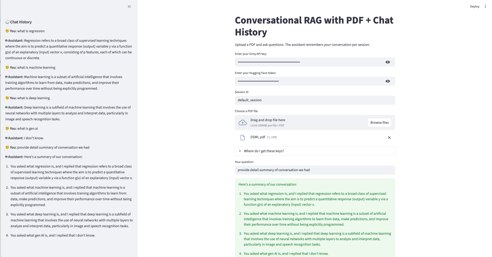

# 📄 Conversational RAG with PDF & Sidebar Chat History

A **Conversational Retrieval-Augmented Generation (RAG)** application built using **Streamlit**, **LangChain**, **Groq LLMs**, **Hugging Face embeddings**, and **ChromaDB**.

This app allows users to **upload a PDF**, ask questions about its content, and continue a **context-aware conversation**.
The **chat history is persistently displayed in the left sidebar**, while the main panel is used for querying and answers.


---

## ✨ Features

* 📄 Upload and query a **PDF document**
* 🧠 Context-aware question answering (conversation memory)
* 🔍 Semantic retrieval using **Hugging Face embeddings**
* ⚡ Fast inference using **Groq LLMs**
* 🧾 Session-based memory with **RunnableWithMessageHistory**
* 📌 **Chat history displayed in the left sidebar**
* 🔐 Secure API key input (Groq & Hugging Face)
* 🗃️ In-memory vector store using **ChromaDB**

---

## 🧱 Tech Stack

| Layer         | Technology                        |
| ------------- | --------------------------------- |
| UI            | Streamlit                         |
| LLM           | Groq (`llama-3.1-8b-instant`)     |
| Embeddings    | Hugging Face (`all-MiniLM-L6-v2`) |
| Vector DB     | Chroma                            |
| RAG Framework | LangChain                         |
| PDF Loader    | PyPDFLoader                       |

---

## 📁 Project Structure

```
.
├── app.py          # Main Streamlit application
├── README.md       # Documentation
└── requirements.txt
```

---

## 🔑 API Keys Required

### 1️⃣ Groq API Key

Create at:
👉 [https://console.groq.com/keys](https://console.groq.com/keys)

### 2️⃣ Hugging Face Token

Create at:
👉 [https://huggingface.co/settings/tokens](https://huggingface.co/settings/tokens)

Both keys are entered securely in the UI and are **not stored on disk**.

---

## 📦 Installation

### 1️⃣ Clone the repository

```bash
git clone https://github.com/sanjip1203/Q-A-chatbot-with-pdf-along-with-chat-history.git 
cd Q-A-chatbot-with-pdf-along-with-chat-history
```

### 2️⃣ Create a virtual environment (recommended)

```bash
python -m venv venv
source venv/bin/activate   # macOS / Linux
venv\Scripts\activate      # Windows
```

### 3️⃣ Install dependencies

```bash
pip install -r requirements.txt
```

---

## 📜 `requirements.txt`

```txt
streamlit
langchain
langchain-community
langchain-chroma
langchain-huggingface
langchain-groq
chromadb
pypdf
sentence-transformers
torch
```

---

## ▶️ Running the Application

```bash
streamlit run app.py
```

Then open the browser link shown in the terminal.

---

## 🧠 How the App Works

### Step-by-Step Flow

1. **User inputs API keys**
2. **PDF is uploaded**
3. PDF text is extracted using `PyPDFLoader`
4. Text is chunked with overlap
5. Embeddings are generated using Hugging Face
6. Chunks are stored in ChromaDB
7. User asks a question
8. Question is rewritten using chat history
9. Relevant chunks are retrieved
10. Groq LLM generates a concise answer
11. Conversation is stored and shown in the sidebar

---

## 🧾 Chat History (Left Sidebar)

* Displayed in the **Streamlit sidebar**
* Maintained per `session_id`
* Used internally for:

  * Question contextualization
  * Conversational continuity

Example:

```
🧑 You: What is the main topic of the document?
🤖 Assistant: The document discusses...
```

---

## 🔐 Security Notes

* API keys are:

  * Entered manually
  * Hidden using password fields
  * Stored only in memory (session-based)
* No credentials or data are persisted

---

## ⚠️ Current Limitations

* Single PDF per session
* No persistent vector database
* Requires active internet connection (Groq & HF)


